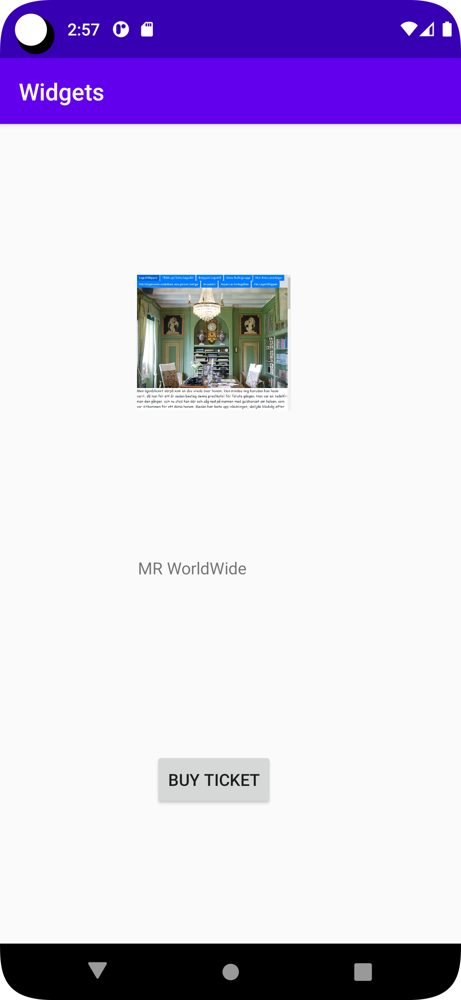

# Rapport

det första jag gjorde var att forka appen widgets.

efter att ha forkat den och öppnat den på visual studio så klickade jag på layout och sedan på activity main xml.

jag placerade 3 elements runt layouten och sedan anvönde jag constraint för positionera de.

    <Button
        android:id="@+id/button2"
        android:layout_width="wrap_content"
        android:layout_height="wrap_content"
        android:text="Buy ticket"
        app:layout_constraintBottom_toBottomOf="parent"
        app:layout_constraintEnd_toEndOf="parent"
        app:layout_constraintHorizontal_bias="0.451"
        app:layout_constraintStart_toStartOf="parent"
        app:layout_constraintTop_toBottomOf="@+id/textView4"
        app:layout_constraintVertical_bias="0.362" />

detta är första elementet som är en button med constrains.

    <TextView
        android:id="@+id/textView4"
        android:layout_width="130dp"
        android:layout_height="100dp"
        android:layout_marginTop="64dp"
        android:text="MR WorldWide"
        app:layout_constraintEnd_toEndOf="parent"
        app:layout_constraintHorizontal_bias="0.448"
        app:layout_constraintStart_toStartOf="parent"
        app:layout_constraintTop_toBottomOf="@+id/imageView" />
detta är andra elementet som är en textview med constrains.

    <ImageView
        android:id="@+id/imageView"
        android:layout_width="131dp"
        android:layout_height="236dp"
        android:layout_marginTop="68dp"
        app:layout_constraintEnd_toEndOf="parent"
        app:layout_constraintHorizontal_bias="0.446"
        app:layout_constraintStart_toStartOf="parent"
        app:layout_constraintTop_toTopOf="parent"
        app:srcCompat="@drawable/bootbild1" />
detta är den tredje elementet som är en imageview med constrains, och den sista raden innehåller bilden. 

Bilder läggs i samma mapp som markdown-filen.

Läs gärna:

- Boulos, M.N.K., Warren, J., Gong, J. & Yue, P. (2010) Web GIS in practice VIII: HTML5 and the canvas element for interactive online mapping. International journal of health geographics 9, 14. Shin, Y. &
- Wunsche, B.C. (2013) A smartphone-based golf simulation exercise game for supporting arthritis patients. 2013 28th International Conference of Image and Vision Computing New Zealand (IVCNZ), IEEE, pp. 459–464.
- Wohlin, C., Runeson, P., Höst, M., Ohlsson, M.C., Regnell, B., Wesslén, A. (2012) Experimentation in Software Engineering, Berlin, Heidelberg: Springer Berlin Heidelberg.
